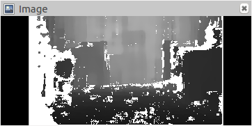
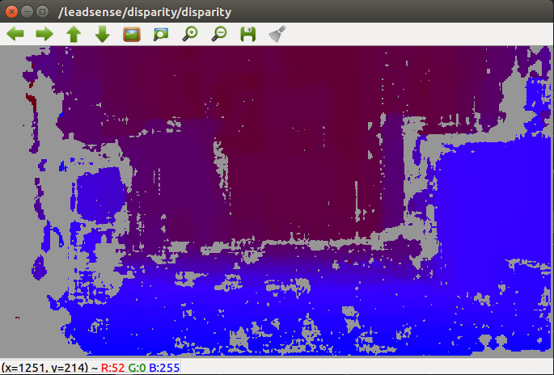
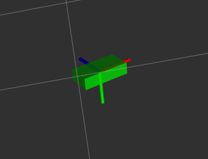
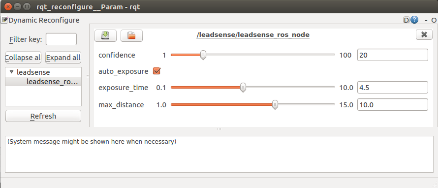

# ROS Package For LeadSense Stereo Camera

This package lets you use the LeadSense stereo camera with ROS. It outputs the rectified left and right images, depth map, disparity, point cloud, IMU information.

## Prerequisites

- Ubuntu 16.04
- EvoBinoSDK >= 1.3.1 and its dependency CUDA
- ROS Kinetic

**Note**: if you want to use LeadSense without GPU, you could edit `leadsense_ros_nodelet.cpp`: change header file from `evo_depthcamera.h` to `evo_stereocamera.h`, and change the camera class from `DepthCamera` to `StereoCamera`.

**Note**: if you want to visualize disparity, you will also need to install the `image_view` package:
```
sudo apt-get install ros-kinetic-image-view
```

**Note**: if you are using a LeadSense with IMU and want to visualize the IMU information using RVIZ, you will also need to install the `IMU plugin`:
```
sudo apt-get install ros-kinetic-rviz-imu-plugin
```

**Note**: if you want to dynamic configure the parameters with GUI, you will also need to install the `rqt_reconfigure` package:
```
sudo apt-get install ros-kinetic-rqt-reconfigure
```

## Quick Start 

1. Create a workspace named **catkin_ws** under your HOME folder following the ros [tutorial](http://wiki.ros.org/catkin/Tutorials/create_a_workspace)

2. Open a terminal, download and build the package:
```
cd ~/catkin_ws/src
git clone https://github.com/ShanghaiEyevolutionTechnology/leadsense_ros.git
cd ../
catkin_make
echo source $(pwd)/devel/setup.bash >> ~/.bashrc
source ~/.bashrc
```

3. Start the LeadSense camera:

with RVIZ:
```
roslaunch leadsense_ros leadsense_rviz.launch 
```
without RVIZ:
```
roslaunch leadsense_ros leadsense_nodisplay.launch 
```

### Rectified Image Topics
- /leadsense/left/image_rect_gray
- /leadsense/right/image_rect_gray

To visualize a image, you can use the simple `Image plugin` since the image data are published on topics of type `sensor_msgs/Image`.


### Depth Topic
- /leadsense/depth/depth_registered

To visualize a depth image, you can use the simple `Image plugin` since the depth data are published on topics of type `sensor_msgs/Image`. The data of depth image is encoded in float (32-bit). Unclick `Normalize Range`, then set distance range with `Min value` and `Max value` for a good visualization result (unit: m).



### Point Cloud Topic
- /leadsense/point_cloud/cloud_registered

To directly visualize a topic of type `sensor_msgs/Pointcloud2` you can use the `Pointcloud2 plugin`.


### Disparity Topic
- /leadsense/disparity/disparity

Use the `disparity_view` node in the `image_view` package to visualize it:

```
rosrun image_view disparity_view image:=/leadsense/disparity/disparity
```



### IMU Topic
Fusion result and raw data topics are provided. When you choose 9 axes mode, fusion is done by 9 axes, and magnet topic is published. When you choose 6 axes mode, fusion is done by 6 axes.

- /leadsense/imu/data

Fusion result and calibrated data. To directly visualize a topic of type `sensor_msgs/Imu` you can use the `IMU plugin`. The orientation and axes will be shown.



- /leadsense/imu/data_raw

Raw data do not have orientation information, so you can not visualize it. You can check the data by:
```
rostopic echo /leadsense/imu/data_raw
```

- /leadsense/imu/mag

Magnet data is published on a topic of type `sensor_msgs/MagneticField`. You can check the data by:

```
rostopic echo /leadsense/imu/mag
```

### Dynamic reconfigure
You can dynamically change many configuration parameters during the execution:

```
rosrun rqt_reconfigure rqt_reconfigure
```


